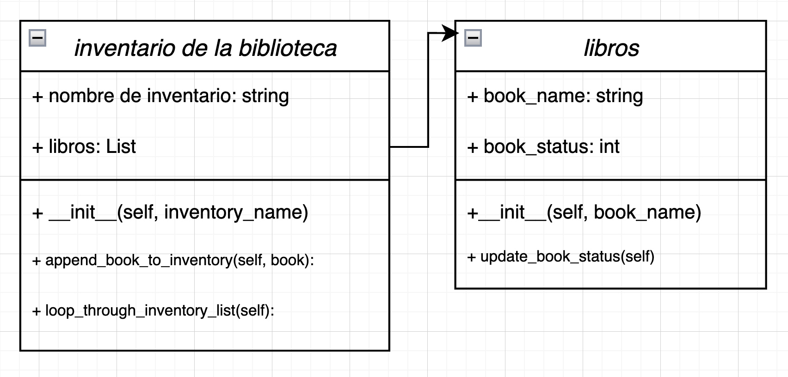

# Girls Who Code: Case Study  
## *Case Study Requirements (4)*  
\- The user can print out a list of each book and its status (“on shelf” or “checked out”)  
\- The user can add new books to the inventory.  
\- The default status of newly added books will be “on shelf”  
\- The user can toggle the status of each book between “on shelf” and “checked out”
  
\- Case Study Link:  
https://docs.google.com/document/d/17dtXVKEkZC_x9OV4rnQxh9yvMdNCIG3KVlT1TZMyF98/edit  
\- Rubric:  
https://docs.google.com/document/d/1pbboQAF8FZD-NFKHKCzE2gcQ7tYQg20VGXLaztOlyYA/edit#heading=h.7cxsh989f2xu  

### 2 WAYS TO SOLVE:  
## OOPC CLASSES  
  

## PYTHON DICTIONARY  
🤔: Need to start  

